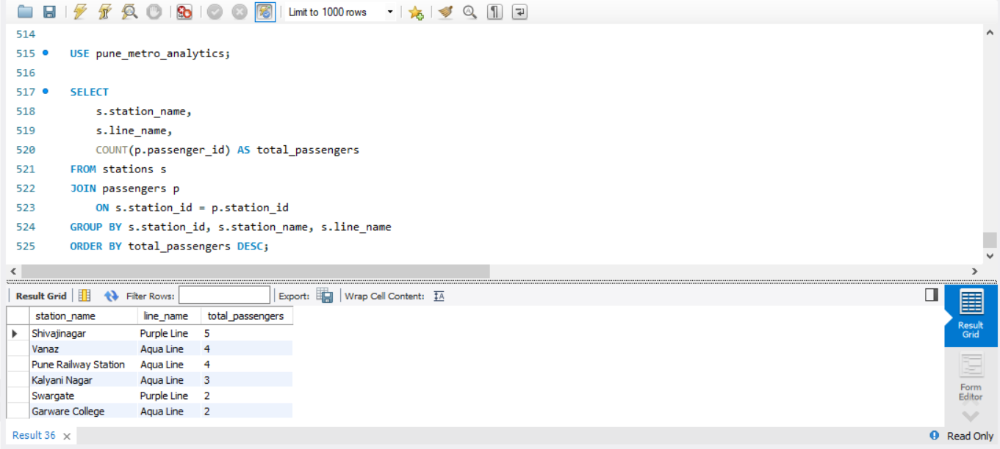
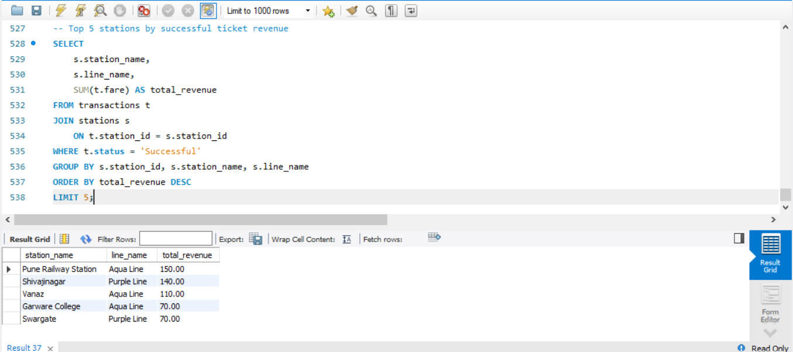
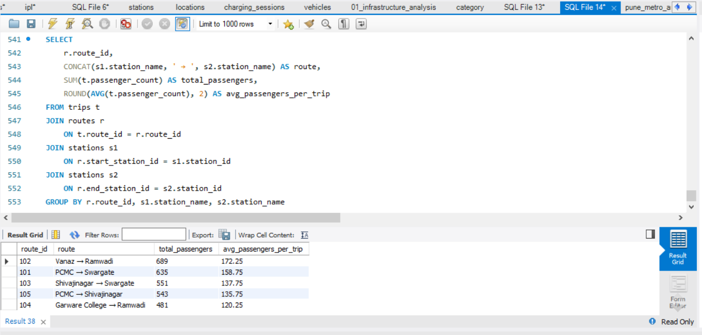

# Pune Metro Operations & Passenger Analytics using SQL

## 📌 Project Overview

This project analyzes Pune Metro operations, passenger travel patterns, routes, ticket revenue, and payment transactions using MySQL.

The project demonstrates how SQL can be used to transform structured transportation data into meaningful business insights.

## 🎯 Objectives

- Analyze passenger traffic across metro stations
- Identify high-demand metro routes
- Analyze peak travel hours
- Compare passenger types
- Analyze ticket revenue
- Identify popular payment methods
- Analyze transaction success rates
- Rank stations and routes based on performance
- Generate useful business insights using SQL

## 🛠️ Technologies Used

- MySQL
- MySQL Workbench
- SQL

## 🗄️ Database Structure

The database contains five main tables:

1. `stations` – Metro station information
2. `routes` – Metro routes and distances
3. `passengers` – Passenger travel information
4. `trips` – Trip and passenger-count information
5. `transactions` – Ticket payment and revenue information

## 🔍 SQL Concepts Used

- SELECT
- WHERE
- GROUP BY
- ORDER BY
- HAVING
- JOIN
- LEFT JOIN
- Aggregate Functions
- CASE
- Subqueries
- Common Table Expressions (CTEs)
- Window Functions
- RANK()
- COALESCE()
- Date and Time Functions

## 📊 Key Analysis Areas

The project answers questions such as:

- Which stations have the highest passenger traffic?
- Which metro line has the highest passenger demand?
- What are the busiest travel hours?
- Which routes carry the most passengers?
- Which stations generate the highest revenue?
- Which payment method is used most frequently?
- What is the transaction success rate?
- Which passenger type generates the highest revenue?
- Which stations have the strongest overall performance?

## 📁 Project Files

```text
Pune-Metro-Operations-Passenger-Analytics/
│
├── pune_metro_analytics.sql
└── README.md

## 📸 SQL Analysis Results

### 1. Station Passenger Traffic


### 2. Top 5 Stations by Revenue


### 3. Route Passenger Analysis

